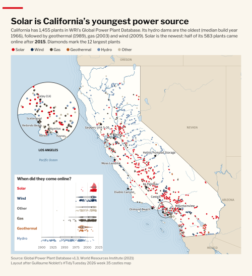

# california_power_plants_map

## California power plants

`R/california_power_plants.R` applies the week 35 design (https://gnoblet.codeberg.page/TidyTuesday/posts/2026/week_35/week_35.html) to the 1,455 California plants in
WRI's [Global Power Plant Database](https://datasets.wri.org/dataset/globalpowerplantdatabase) v1.3.
Dots are coloured by fuel, diamonds mark the 12 largest plants, the loupe zooms into Los Angeles, and the raincloud
shows commissioning years by fuel.



```r
source("R/california_power_plants_.R")   # writes output/power_plants_california.png and output/power_plants_california_thumb.png
```

The database has no state column, so plants are kept with a spatial filter against Natural Earth's California
polygon. California was chosen because commissioning years are complete there; they are missing for the UK and
France and for German solar plants.